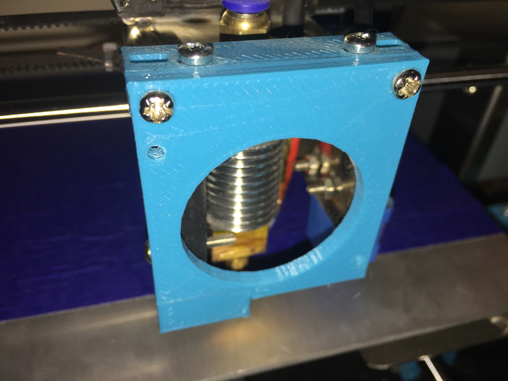
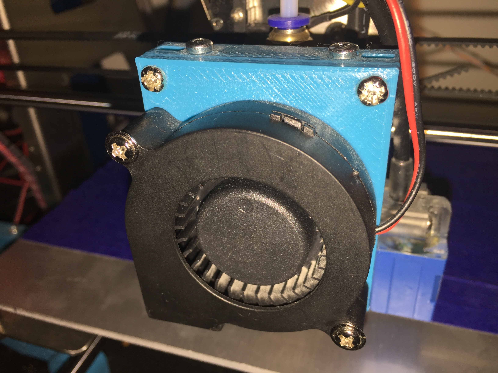
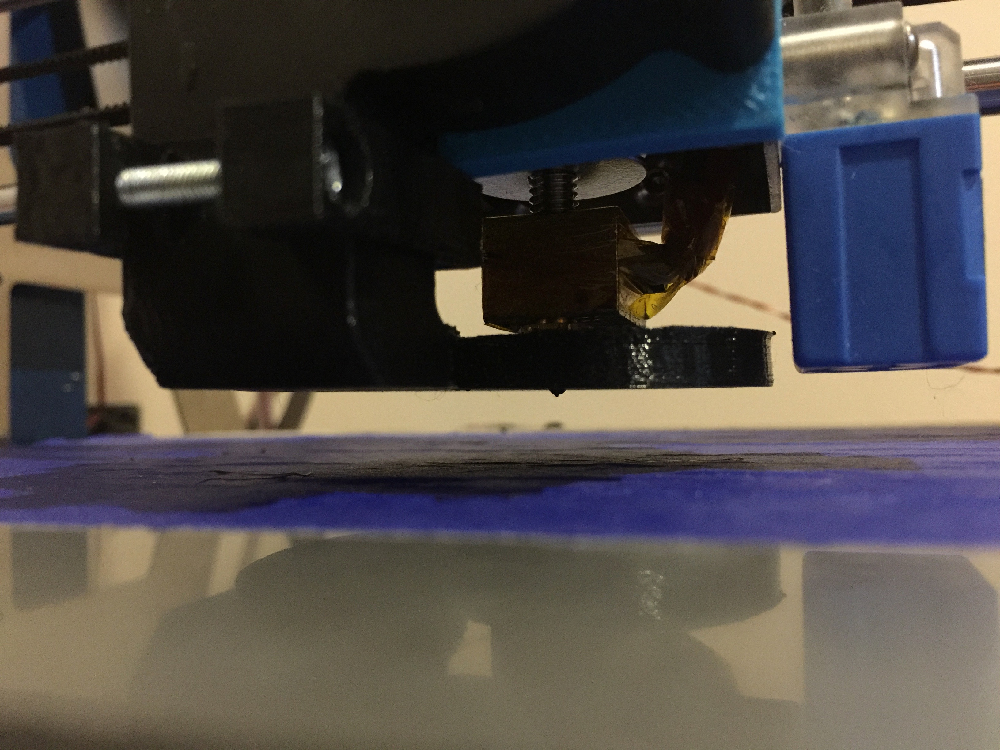
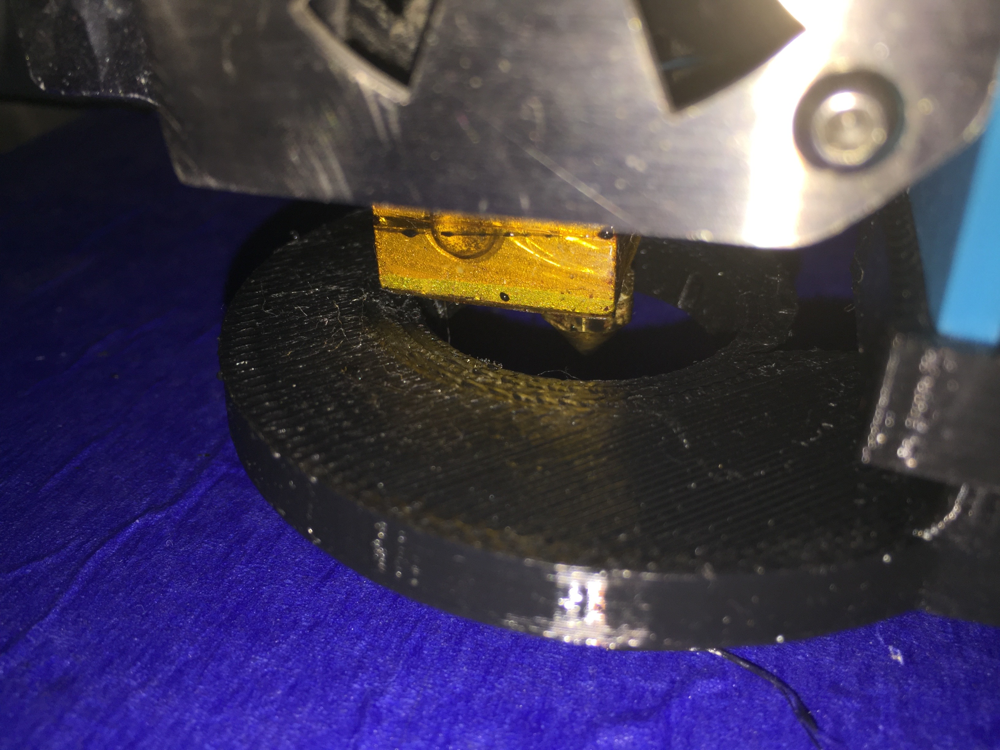

# Zonestar P802Q Fan Duct

This repository includes a number of parts which are designed to improve the fan duct of the [Zonestar P802Q/P802QA](http://www.aliexpress.com/item/full-Metal-Reprap-Prusa-i3-3d-Printer-DIY-kit-Stainless-Steel-Easy-Installation-2-Roll-Filament/32586716087.html?spm=2114.40010308.4.2.iW3265) 3D printer. The design is loosely based on a [Francis Turbine](https://en.wikipedia.org/wiki/Francis_turbine).

## Motivation

This printer is inexpensive and generally well built but the default fan duct leaves much to be desired. I wanted to improve bridging performance and explore turbine design.

## Parts Required

- Original M3 screws for mounting fan.
- 2x M3x12 for top fan mount.
- 2x M3x10 + bolts for fan front bracket.
- 1x M3x20 + bolt for clip to hold on duct.

## Instructions

### Fan Mount

The fan mount is usually not very accurate, so the included parts allows for some lateral alignment as required.

1. Print out the fan mount parts.
2. Remove the existing fan mount, and attach the new one.
3. Attach the existing fan on the mount.

### Duct Installation

The duct height is critical, and it is difficult to print. I suggest 50% perimeter overlap and minimum 1 layer perimeter, otherwise the thin walls won't print correctly to allow the top cover bridging. Additionally, I had issues using slic3r 1.2.9 so check that the bridging is being done in a way that is actually feasible before printing.

1. Print out the fan duct and clip.
2. Prepare the clip by slipping over the fan duct.
3. With some effort, slot the whole lot over the blower fan nozzle.

Position the duct so that there is about 1mm clearance below (relative to the print head), and so that it is not touching the hot end either. Ensure that the duct is level with the print bed.

As you can see from the following picture, some contact may occur if you are not careful. The addition of some aluminium tape may be helpful to prevent significant damage to the surface of the duct.

## Contributing

1. Fork it
2. Create your feature branch (`git checkout -b my-new-feature`)
3. Commit your changes (`git commit -am 'Add some feature'`)
4. Push to the branch (`git push origin my-new-feature`)
5. Create new Pull Request

## License

Released under the MIT license.

Copyright, 2016, by [Samuel G. D. Williams](http://www.codeotaku.com/samuel-williams).

Permission is hereby granted, free of charge, to any person obtaining a copy of this software and associated documentation files (the "Software"), to deal in the Software without restriction, including without limitation the rights to use, copy, modify, merge, publish, distribute, sublicense, and/or sell copies of the Software, and to permit persons to whom the Software is furnished to do so, subject to the following conditions:

The above copyright notice and this permission notice shall be included in all copies or substantial portions of the Software.

THE SOFTWARE IS PROVIDED "AS IS", WITHOUT WARRANTY OF ANY KIND, EXPRESS OR IMPLIED, INCLUDING BUT NOT LIMITED TO THE WARRANTIES OF MERCHANTABILITY, FITNESS FOR A PARTICULAR PURPOSE AND NONINFRINGEMENT. IN NO EVENT SHALL THE AUTHORS OR COPYRIGHT HOLDERS BE LIABLE FOR ANY CLAIM, DAMAGES OR OTHER LIABILITY, WHETHER IN AN ACTION OF CONTRACT, TORT OR OTHERWISE, ARISING FROM, OUT OF OR IN CONNECTION WITH THE SOFTWARE OR THE USE OR OTHER DEALINGS IN THE SOFTWARE.